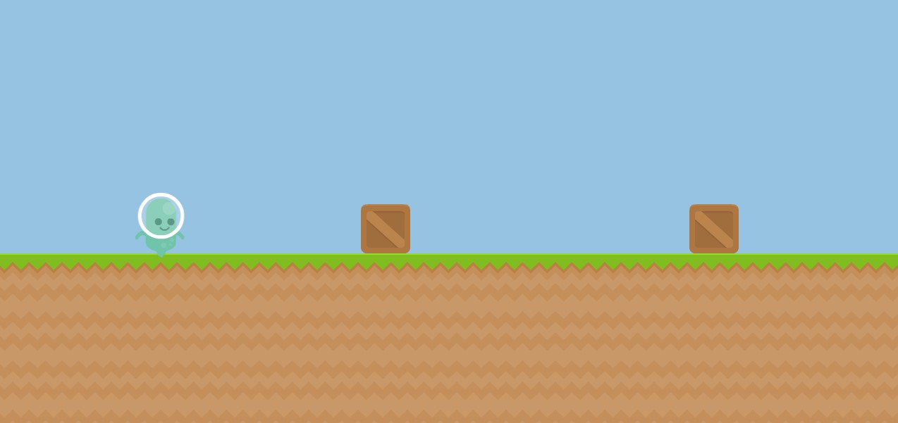

# Dino Pixi
A game where you need to jump as long as possible, made with pixi.js



## [Play It](https://cubbk.github.io/dino-pixi/)

## Install
  ```
  git clone https://github.com/cubbK/dino-pixi.git
  cd dino-pixi
  npm install
  npm start
  ```
  It uses [create-react-app](https://github.com/facebookincubator/create-react-app) config with [custom-react-scripts](https://github.com/kitze/custom-react-scripts). Don't be scared by the use of word 'react' :smiley:, it's just a cool base webpack config which lets you use all the features of es6+ like [imports](https://medium.com/ecmascript-2015/es6-modules-d5646d1b9a08) and what not. You don't *have to* use react.

